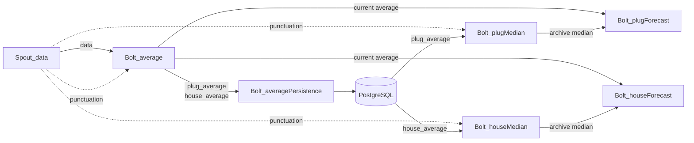

# Storm Smart Home Plus

Hệ thống này mô phỏng và xử lý dữ liệu tiêu thụ điện theo bài toán DEBS 2014, dùng Apache Storm để tính trung bình theo cửa sổ thời gian, lưu dữ liệu lịch sử vào PostgreSQL và tính các bước dự đoán tiếp theo từ dữ liệu đã tổng hợp.

## Topology

Topology có dạng sau:



Luồng xử lý chính:

1. `Spout_data` đọc dữ liệu MQTT và phát tuple `data`.
2. `Bolt_average` tính trung bình hiện tại cho từng cửa sổ thời gian.
3. `Bolt_averagePersistence` ghi các giá trị trung bình vào PostgreSQL.
4. `Bolt_plugMedian` và `Bolt_houseMedian` đọc dữ liệu lịch sử từ PostgreSQL để tính median archive.
5. `Bolt_plugForecast` và `Bolt_houseForecast` join average với median để log kết quả forecast.

## Cấu trúc chính

- `mqtt-broker/`: Docker image và cấu hình Mosquitto.
- `mqtt-publisher/`: công cụ phát dữ liệu mẫu từ CSV.
- `postgres/`: script khởi tạo bảng PostgreSQL.
- `storm-config/`: cấu hình Storm cluster.
- `storm-topology/`: source code topology Apache Storm.

## Chạy hệ thống

### 1. Build MQTT broker

```bash
cd mqtt-broker
docker build -t mqtt-broker-iotdata .
```

### 2. Khởi động hạ tầng

```bash
docker compose up -d
```

### 3. Build topology

```bash
cd storm-topology
mvn clean install
```

### 4. Submit topology lên Storm

```bash
docker exec -it nimbus bash
storm jar Storm-IOTdata-1.0-SNAPSHOT-jar-with-dependencies.jar com.storm.iotdata.MainTopo
```

### 5. Phát dữ liệu thử nghiệm

Chạy `mqtt-publisher` để gửi dữ liệu từ các file CSV trong `mqtt-publisher/data-file/` lên broker.

## Ghi chú

- Topology đọc toàn bộ cấu hình từ `storm-topology/src/main/resources/config/conf.yaml`.
- Các bolt forecast hiện chỉ log kết quả, không emit stream output.
- Dữ liệu lịch sử được lưu và truy vấn từ PostgreSQL qua các bảng `plug_average` và `house_average`.