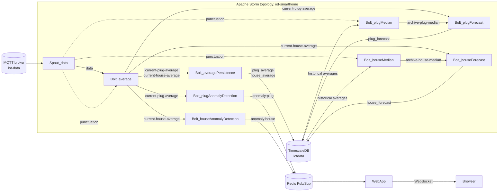

# Storm Smart Home Plus

Storm Smart Home Plus mô phỏng việc xử lý dữ liệu điện năng theo dataset DEBS 2014. Dữ liệu được replay từ CSV qua MQTT, xử lý bởi Apache Storm, lưu vào TimescaleDB, phát hiện bất thường qua Redis và hiển thị cảnh báo trên WebApp.

## Kiến trúc

Topology được khai báo trong `storm-topology/src/main/java/com/storm/iotdata/MainTopo.java`. Các cửa sổ thời gian hiện tại là `1`, `5`, `15`, `60` và `120` phút; trong sơ đồ dưới đây chúng được biểu diễn bằng một node đại diện.


```mermaid
flowchart LR
    MQTT[(MQTT broker<br/>iot-data)] --> S[Spout_data]

    subgraph STORM[Apache Storm topology: iot-smarthome]
        S -->|data| A[Bolt_average]
        S -.->|punctuation| A

        A -->|current-plug-average<br/>current-house-average| P[Bolt_averagePersistence]
        A -->|current-plug-average| PA[Bolt_plugAnomalyDetection]
        A -->|current-house-average| HA[Bolt_houseAnomalyDetection]

        S -.->|punctuation| PM[Bolt_plugMedian]
        S -.->|punctuation| HM[Bolt_houseMedian]

        A -->|current-plug-average| PF[Bolt_plugForecast]
        PM -->|archive-plug-median| PF
        A -->|current-house-average| HF[Bolt_houseForecast]
        HM -->|archive-house-median| HF
    end

    DB[(TimescaleDB<br/>iotdata)]
    P -->|plug_average<br/>house_average| DB
    DB -->|historical averages| PM
    DB -->|historical averages| HM
    PF -->|plug_forecast| DB
    HF -->|house_forecast| DB

    PA -->|anomaly:plug| R[(Redis Pub/Sub)]
    HA -->|anomaly:house| R
    R --> W[WebApp]
    W -->|WebSocket| UI[Browser]
```

### Luồng xử lý

1. `Spout_data` subscribe topic MQTT `iot-data`, lọc các bản ghi điện năng (`property = 1`) và phát stream `data` cùng các punctuation.
2. `Bolt_average` tính average hiện tại theo plug và house, sau đó phát `current-plug-average` và `current-house-average`.
3. `Bolt_averagePersistence` ghi các average vào `plug_average` và `house_average`.
4. `Bolt_plugMedian` và `Bolt_houseMedian` đọc dữ liệu lịch sử để tạo median archive.
5. Các bolt forecast kết hợp average hiện tại với median lịch sử, tính forecast và ghi vào `plug_forecast` hoặc `house_forecast`.
6. Các bolt anomaly duy trì thống kê rolling, kiểm tra ngưỡng `20%` và publish cảnh báo lên Redis. WebApp chuyển cảnh báo từ Redis đến trình duyệt qua WebSocket.

## Cấu trúc chính

- `data-preprocess/`: chuẩn bị dữ liệu CSV.
- `mqtt-broker/`: cấu hình Mosquitto.
- `mqtt-publisher/`: replay CSV lên MQTT.
- `timescaledb/`: schema, dữ liệu mẫu và database dump.
- `storm-config/`: cấu hình Storm và ZooKeeper.
- `storm-topology/`: source code topology Apache Storm.
- `storm-exporter/`, `prometheus/`, `grafana/`: monitoring.
- `webapp/`: giao diện và WebSocket server nhận anomaly.

## Yêu cầu

- Docker và Docker Compose.
- JDK 8 trở lên, Maven.
- Node.js và npm nếu muốn replay dữ liệu bằng `mqtt-publisher`.

## Chạy hệ thống

### 1. Build topology và exporter

```bash
cd storm-topology
mvn install
cd ..
docker build -t stormexporter:v1 ./storm-exporter
```

### 2. Khởi động các dịch vụ

```bash
docker compose up -d
docker compose ps
```

Compose sử dụng database `iotdata` trong TimescaleDB với tài khoản mặc định `postgres`/`postgres` và khởi tạo từ `timescaledb/dump/iotdata.dump`.

### 3. Submit topology

```bash
docker exec nimbus storm jar \
  /apache-storm-2.5.0/Storm-IOTdata-1.0-SNAPSHOT-jar-with-dependencies.jar \
  com.storm.iotdata.MainTopo
```

Topology có tên `iot-smarthome`. Storm UI chạy tại <http://localhost:8080>, Grafana tại <http://localhost:3000> và WebApp tại <http://localhost:3001>.

### 4. Replay dữ liệu

```bash
cd mqtt-publisher
npm install
node src/main.js --broker localhost --port 1883 \
  --file data-file/house-0.csv --topic iot-data
```

Có thể xem thêm các tùy chọn như `--speed-factor`, `--use-current-time`, `--qos` và `--retain` trong [mqtt-publisher/README.md](mqtt-publisher/README.md).

## Cấu hình chính

Các cấu hình của topology hiện được khai báo trực tiếp trong `StormConfig.java`:

- MQTT: `tcp://mqtt-broker:1883`, topic `iot-data`.
- TimescaleDB: `jdbc:postgresql://timescaledb:5432/iotdata`.
- Redis: `redis:6379`, channels `anomaly:plug` và `anomaly:house`.
- Window sizes: `1`, `5`, `15`, `60`, `120` phút.
- Anomaly threshold: `20%`.

Nếu cần tạo lại database từ CSV, xem [timescaledb/README.md](timescaledb/README.md).
